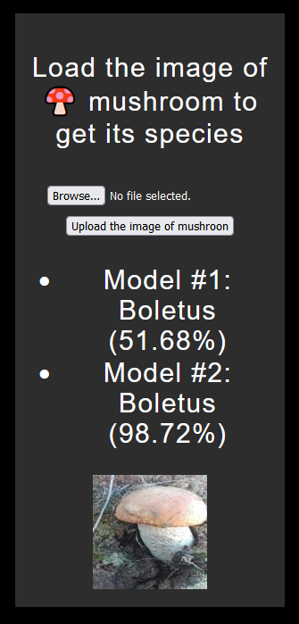
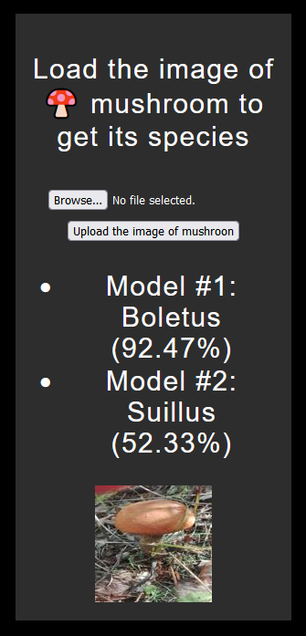
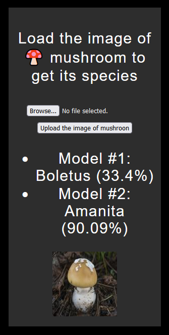
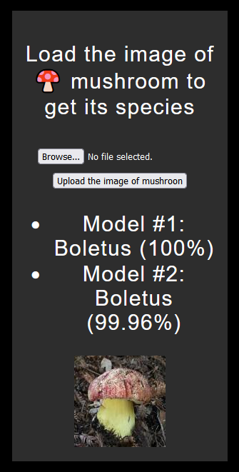

# MyShroom-Classifier-App
Project for forest mushrooms classification.
## Overview

In this project I used the [MyShroomClassifier Image Dataset](https://universe.roboflow.com/myshroom-dataset-preprocessing/myshroomclassifier/dataset/1). I've removed all monochrome images from this dataset and also I've balanced out the classes using augmentation. After such manipulations each class of mushrooms was consisting of ~2500 images. Keras framework was used in order to train two neural networks:
* CNN (~70% accuracy on test dataset)
* Transfer learning network, VGG19 (~80% accuracy on test dataset)

To provide the ability for user to pass the images to ANNs and to receive predictions from them Flask web-framework was used.

## Demonstration:

